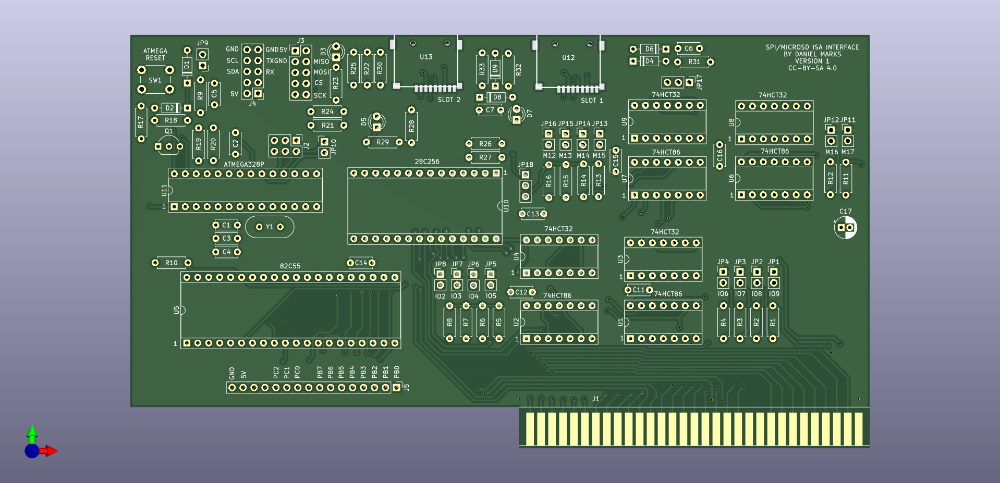

# PC Storage Interface and Arduino Inteface

This is a simple card that provides two SD cards as mass storage devices as will provide an SPI interface.  A ATMEGA328P programmed using the Arduino development environment is interfaced to the ISA bus using a 82C55 peripheral interface.  The design uses only commonly available integrated circuits, the 74HCT86 XOR gate, 74HCT32 OR gate, 82C55A peripheral interface, a 28C256 flash memory chip, and a ATMEGA328P microcontroller, and so should be reasonably future-proofed as much as any design for a 40 year old computer can be.

The gerbers for the PCB are in the ISACard directly can be made by JLCPCB or PCBway, for example.    
