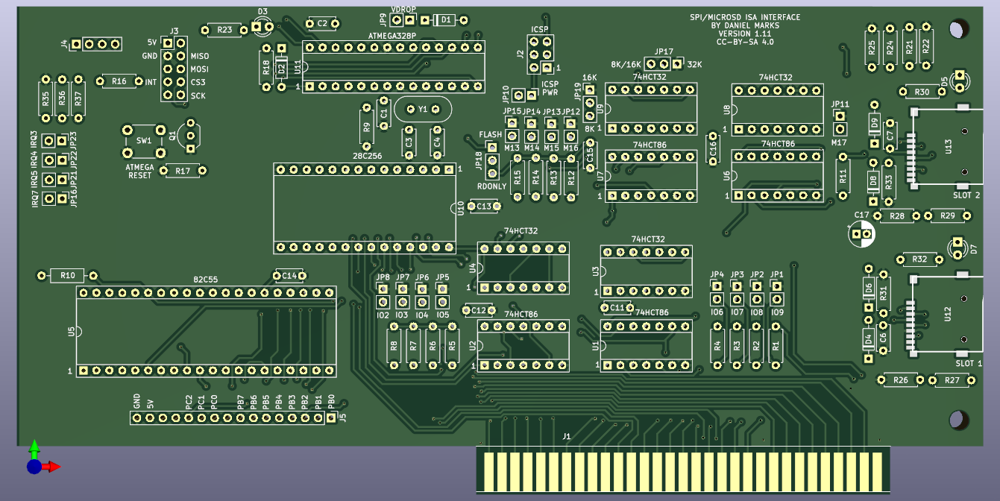

# PC Storage Interface and Arduino Inteface

This is a simple card that provides two SD cards as mass storage devices on PC compatibles in an ISA slot.  This design is an adaptation of the Apple II version of the card (<https://www.github.com/profdc9/Apple2Card>).  For building in the future, it is designed to use only the most common chips: 74HCT32, 74HCT86, 28C64B/27C128/28C256, 82C55A, and ATMEGA328P.  It does not use Compactflash format as that is a rather uncommon memory card format at the time of this writing (Oct 2025).  The SD card interface is not as fast as a Compactflash card, however, being read through SPI.  Hopefully, the components to build this board will be available for many years to come to retro enthusiasts.

There is also a 10 pin SPI port to connect an external Wiznet 5500 Ethernet port.  A simple packet driver needs to be written to interface this to the MSDOS TCP/IP stacks.

The Arduino firmware (in the ISA2Arduino directory) communicates through the 8255 bidirectional parallel port to the ISA bus.  It can expose a SD card either as a single raw block device, or it can use an image file on a FAT16/32 filesystem on the SD card as the block device.  Block device image files are named `BLKDEVXX.IMG` where XX is a hexadecimal number between 01h and 0FFh denoting the file number.  The default (and fallback) is to use `BLKDEV01.IMG` on the SD card in SLOT 1 if it is formatted for a FAT FS.  There is a MSDOS COM file called "SETBLKDV" that sets the block device number to both SD slots, with the format being:

```shell
SETBLKDV <I/O address in hex> <block device number slot 1 in hex> <block device number slot 2 in hex>.
```

For example, to set the block device to 02h on slot 1 and 0Ch on slot 2, with the card being at I/O address 0330h:

```shell
SETBLKDV 330 02 0C
```

Block device number 00h is reserved for exposing the entire SD card as a raw block device (partition table and everything) to the host.  If you do not intend for the entire card to be usable and modifiable by the host, then do not choose this option.  Most modern SD cards have a very large capacity as compared to what MSDOS is designed to handle.  SD cards with up to 8.4 GB capacity can be accommodated by C/H/S addressing using 255 heads and 63 sectors, but larger cards can be accommodated only by LBA.  Therefore larger cards are likely only to be usable by FreeDOS or another operating system designed to handle that case.

The BIOS on the card is a modified version of the XT IDE Universal BIOS with a driver added for the SD card device.  It must be configured using the xtidecfg.com program as is required by other versions of the XT IDE Universal BIOS.  As a bonus, you get the other features of the XT IDE Universal BIOS as well, and it should support the other IDE devices already in the BIOS.  The card supports up to a 32 KB ROM, with the jumpers enabling 8K, 16K, or 32K ROM sizes.  Read only and writing may also be enabled for the EEPROM so that the flash utility may work.

As with other ISA cards that use a BIOS expansion ROM (<https://minuszerodegrees.net/rom/misc/ROM%20-%20BIOS%20expansion%20ROM.jpg>), a model IBM 5150 (original IBM PC) must have a 10/27/82 dated revision of the motherboard BIOS (<https://minuszerodegrees.net/5150/bios/5150_bios_revisions.htm>), or a Compaq Portable must have at least revision C of the motherboard BIOS.

The jumpers to set the BIOS location are labeled M13 to M17 on the board so that the ROM may be located to any 8k address in the upper 0C0000h to 0FFFFFh address space.  A shorted jumpered location indicates a zero bit, and an open jumper location is a one bit.  For example, address 0D0000h (the most common XT IDE Universal BIOS address) is M17, M15, M14, M13 shorted, and M16 open. Two jumpers enable the M13 and M14 address lines to be ignored so that a larger ROM may be used.  Similarly, the IO address is marked IO2 to IO9, which may be located at any multiple of four between 000h and 3FCh.  For the default address 330h, the jumpers are set to: IO7, IO6, IO3, IO2 shorted, IO9, IO8, IO5, IO4 open.  JP17 sets the ROM size to be 32K or 8K/16K, and JP19 sets the ROM size to be 8K or 16K.  JP18 sets the ROM to be read only or ready to be flashed.

There is an ICSP connect that may be used to flash the ATMEGA328P in situ.  Make sure any SD cards are removed from the slots before flashing!  JP10 must be jumpered to power the board with the programmer.

JP9 shorts out a diode that drops the voltage on the ATMEGA328P.  Usually JP9 should be present but may be removed if there are problems with some SD cards.  J4 is a debugging connector, and J3 is a connector intended to go to a Wiznet 5500 ethernet module through a 10 position IDC cable.



## Licensing

The software derived from the GNU General Public License 2.0 (XT IDE Universal BIOS) is likewise licensed under the GNU General Public License 2.0 as required by the license with the modified source code being publically made available here on the GitHub.  Often software written by me is licensed under the zlib license.

The schematic designs (but not the circuit design itself) and the PCB layouts are copyrighted according to the Creative Commons 4.0 Attribution Share-Alike license.

None of these licenses should prevent anyone who wishes to reproduce this hardware and software and sell it from doing so, even for a profit.  However, source code modifications to the GPL licensed code must be made available with the product and likewise licensed under the GPLv2.
